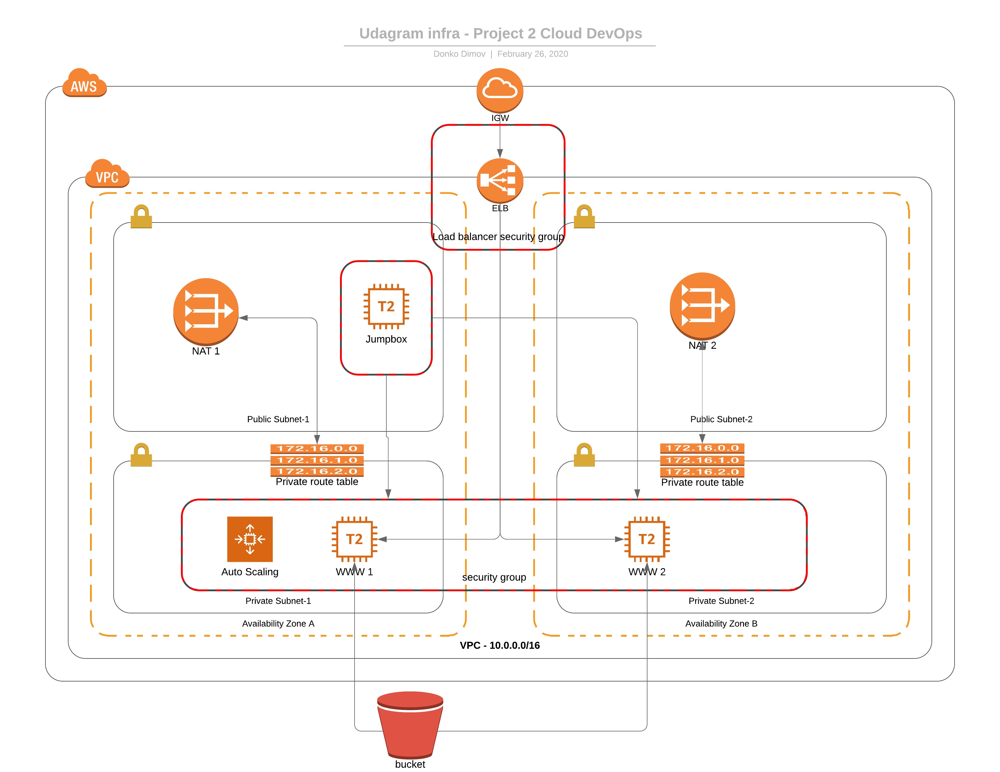

# Deploy a highly available web application using CloudFormation

The scripts in this folder will deploy the infrastructure and 4 web servers for a highly available web app using CloudFormation.
In case troubleshooting is needed a bastion host can be deployed in one of the public networks.

## Infrastructure Overview


To deploy the networking components run command:
```
./create.sh udagram-net udagram-infra.yaml udagram-infra.json
```

To deploy the servers, security roles and software run command:
```
./create.sh udagram-servers udagram-servers.yaml udagram-servers.json
```

To deploy the bastion host run command:
```
./create.sh Bastion jumpbox.yaml jumpbox-parameters.json
```
